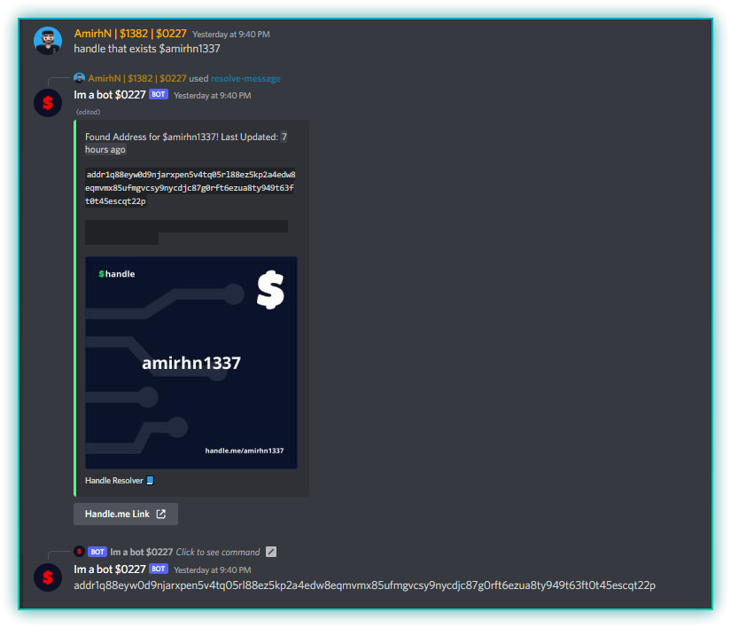
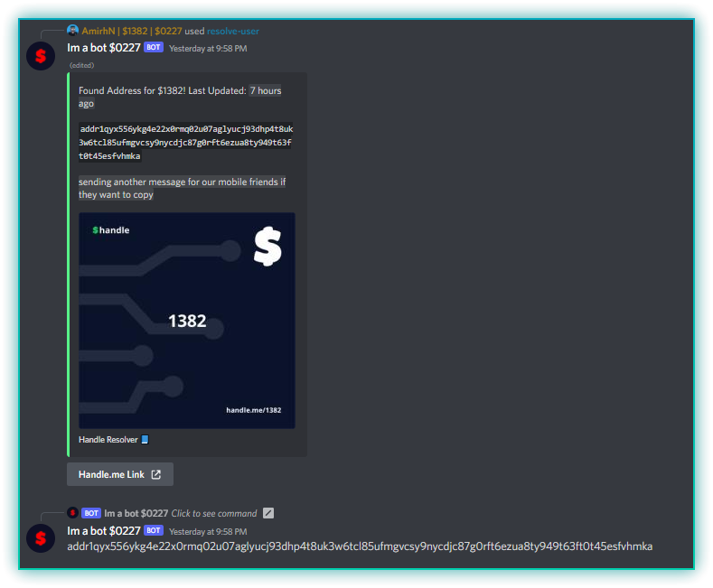
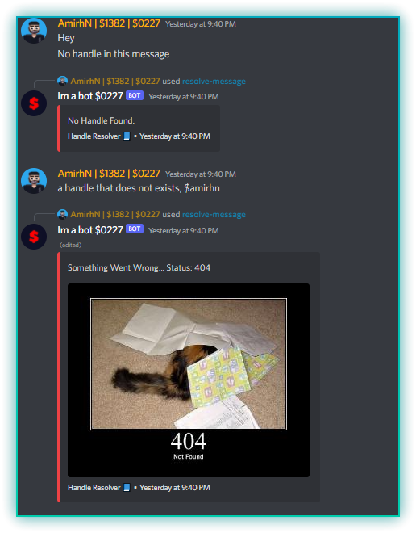

# Handle Resolver
### What is Handle?
Well, i suggest you to check their [website](https://adahandle.com/faq).
### What does this bot do?
You can convert Handles in user nicknames & messages to addresses.\
it might sound useless as most of wallets support it, but in case:\
- your wallet does not support handles.
- you need to get the address for an CEX.
- you need the full address for any other reason.
Handle Resolver is here to help!
### How does it work?
Right click on a message OR server member, then select apps, then hit `resolve-message` or `resolve-user`. ta daaa.

## Screenshots

## Support

For support, join our [Discord Server](https://discord.gg/rfueVMUzq7).

## FAQ

#### Does this require permissions?

Nope, this bot works with discord's new command system and interactions, and does not require ANY permission, not even send message or view channels.

#### Can i fork/download and change everything?

Yup. totally open-source and free to use. feel free to improve and PR.

